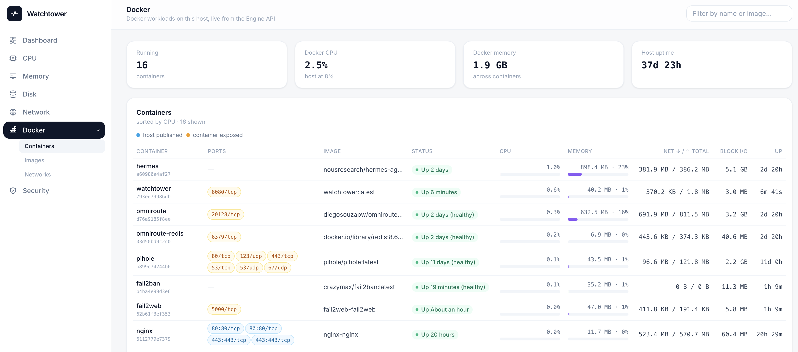
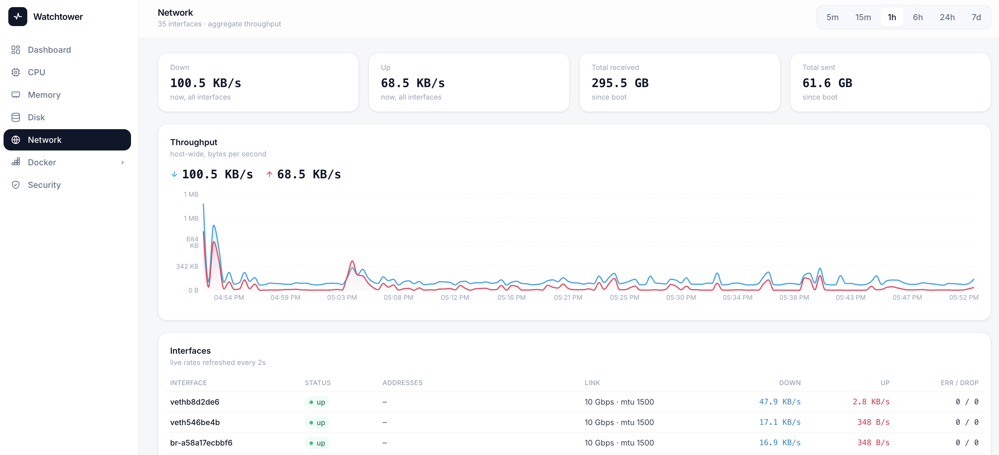
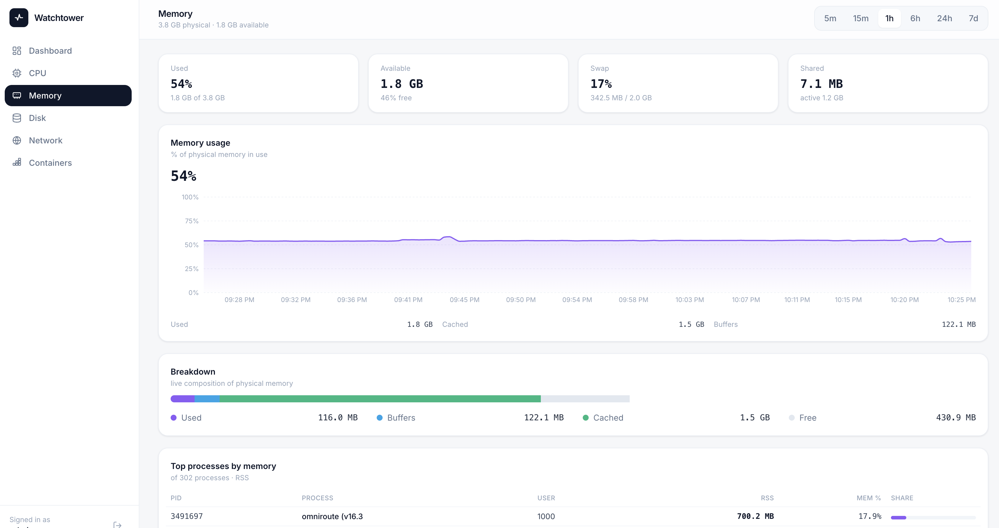
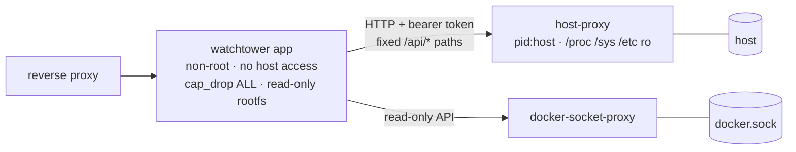

# Watchtower

A lightweight, self-hosted **VPS / server monitor** with a modern web UI.
Runs as a Docker container on your server and reports the **host's**
CPU, memory, disk I/O, network throughput, uptime and process count — with
time-range selectors and live-updating charts.

Most host monitors get full visibility the blunt way: `privileged: true`, the
Docker socket mounted in, or the whole host filesystem bind-mounted "read-only".
Watchtower takes the **least-privilege** route instead — the web app itself has
**zero host access**: a tiny read-only **host-proxy** sidecar owns the narrow
`/proc`/`/sys`/config-file reads (exactly like
[docker-socket-proxy](https://github.com/Tecnativa/docker-socket-proxy) owns
the Docker socket), and each sidecar exposes only an allow-listed, token-gated
API. Same visibility, dramatically smaller attack surface.

  

<!-- Replace the images in docs/screenshots/ with your final captures. -->








## Features

- **Sidebar + drill-down pages** — Dashboard overview plus dedicated pages:
  **CPU** (per-core bars, user/system/iowait breakdown, top processes),
  **Memory** (used/buffers/cached breakdown, top processes by RSS),
  **Disk** (partitions, per-device I/O), **Network** (per-interface rates,
  link speed, IPs, errors/drops) and **Containers** (live per-container
  CPU %/mem %/net/block I/O from the Docker Engine API).
- **Host metrics** — reads the host's `/proc` & `/sys` (mounted read-only) so
  you monitor the VPS itself, not the container. Includes host network
  interfaces: per-NIC rates from `/proc/net/dev`, link state/speed/MTU from
  `/sys/class/net`, and real host IPs (a container's own network namespace
  would only ever show its Docker bridge IP).
- **Security page** — read-only host visibility, **derived facts only**: UFW
  status and default policies, iptables/nftables rules, listening sockets in
  the *host* network namespace, effective sshd config (first-value-wins across
  `sshd_config` and its `sshd_config.d` drop-ins, with shadowed lines marked as
  ignored) and failed/accepted auth **counts**. Raw `auth.log` lines, process
  command lines and `/proc/<pid>/environ` never leave the proxy.
- **Charts + time selectors** — 5m / 15m / 1h / 6h / 24h / 7d, with
  server-side downsampling so long ranges stay fast.
- **Live** — summary values refresh every 3s, charts every 10s, detail pages
  every 2–3s.
- **Auth** — single admin login, server-side sessions in SQLite, HttpOnly
  cookie with sliding expiry.
- **Tiny footprint** — a small web image plus two minimal sidecars
  (host-proxy, socket-proxy), SQLite storage, 7-day retention.

## Least privilege, by design

If this app were compromised, what could it touch? That question shapes
every host-access decision — compare against how typical monitors solve the
same problems:

| Need | Common approach | Watchtower |
| --- | --- | --- |
| Host metrics | `privileged: true` or running an agent directly on the host | A dedicated **host-proxy** container holds `pid: host` + `/proc` and `/sys` mounted **read-only** and serves one allow-listed JSON API over an internal-only network; the web app itself has no host mounts, no `pid: host`, `cap_drop: ALL`, read-only rootfs, and runs as a **non-root user** |
| Docker visibility | Mount `/var/run/docker.sock` into the app (root-equivalent on the host) | [docker-socket-proxy](https://github.com/Tecnativa/docker-socket-proxy) sidecar allow-listing **four read-only endpoints** (`CONTAINERS`, `STATS`, `IMAGES`, `NETWORKS`); exec, kill, create, delete are denied at the proxy, the raw socket never touches the app container, and the proxy sits on its **own internal network** — nothing else (not even the reverse proxy) can reach its unauthenticated `:2375` |
| Firewall / sshd state | Shell out to `ufw status` / read `/etc/shadow`-adjacent paths with broad mounts | The host-proxy parses exactly **five config files** (`/etc/ufw/*`, `/etc/nftables.conf`, `/etc/ssh`) plus one log (`/var/log/auth.log`), each mounted individually, read-only, and reduces them to **derived JSON** — counts and effective settings, never raw log lines. The whole endpoint can be denied with `WT_ALLOW_SECURITY=0` (drop the mounts too, and the files become unreachable even to the proxy) |
| Listening sockets | Run `ss`/`netstat` in a privileged sidecar | Read `/proc/1/net/*` directly — host truth, zero execution |
| Disk partitions | Bind-mount the whole host root "just for statvfs" | Host mount table from `/proc/1/mounts`; the root disk is measured through the container's own filesystem (it lives on it). Extra data disks appear **only** if you opt in by mounting that one path |
| Network exposure | Publish a port on the host interface (`-p 8080:8080`) | **No published ports, ever** — reachable only through your own reverse proxy over an internal Docker network |

The upshot: the app holds no host write access, no root-equivalent socket,
no shell-outs, and no inbound port. It reads exactly the files it parses and
nothing more — so "what does this do to my server?" has a short, auditable
answer.

### The two sidecars



`host-proxy` and `docker-socket-proxy` each sit on their **own** `internal:
true` network (`host-proxy.net`, `docker-proxy.net`) joined by nothing but the
app container — `watchtower.net` (where the reverse proxy lives) cannot reach
either. `docker-socket-proxy`'s API is unauthenticated, so isolation is what
makes it safe.

The `host-proxy` (`hostproxy/`, its own image) is the only container with
host visibility, and its policy mirrors docker-socket-proxy's env-var model:
**GET only** (no write path exists), a shared bearer token
(`WT_HOST_PROXY_TOKEN`, fail-closed when unset), and one allow/deny flag per
endpoint — `WT_ALLOW_METRICS`, `WT_ALLOW_DETAILS`, `WT_ALLOW_SECURITY`.
It lives on an `internal: true` Docker network (no internet route, reachable
only by the app container), runs with `cap_drop: ALL`, `no-new-privileges`
and a read-only rootfs. If the web app is ever compromised, the attacker
can at most make token-gated, allow-listed reads — never touch `/proc`,
`/etc`, the Docker socket or the filesystem.

## Quick start (Docker — on your server)

```bash
cp .env.example .env      # set WT_ADMIN_USER / WT_ADMIN_PASSWORD / WT_SECRET_KEY
                          # and WT_HOST_PROXY_TOKEN (app ↔ host-proxy bearer token)
# generate a secret:  openssl rand -hex 32
docker compose up -d --build
```

The app publishes **no host port** — `docker compose up` creates a
`watchtower.net` network, and the reverse proxy container joins it to reach
the app at `http://watchtower:8080`. See the next section.

### Running on a subdomain behind a reverse proxy (nginx container)

Join your nginx container to the network this stack creates — one-off:

```bash
docker network connect watchtower.net nginx
```

(or declare `watchtower.net` as `external: true` in nginx's own compose
file). Then set `WT_COOKIE_SECURE=true` in Doppler for an HTTPS-only session
cookie. Nothing else changes: the frontend uses relative `/api` URLs, so it
works on any hostname, and there are no redirects that depend on the Host
header.

In the nginx container's config, proxy straight to the service name:

```nginx
server {
    listen 443 ssl http2;
    server_name watchtower.example.com;
    # ssl_certificate ... / ssl_certificate_key ...

    location / {
        proxy_pass http://watchtower:8080;
        proxy_set_header Host $host;
        proxy_set_header X-Real-IP $remote_addr;
        proxy_set_header X-Forwarded-For $proxy_add_x_forwarded_for;
        proxy_set_header X-Forwarded-Proto $scheme;
    }
}
```

Since there is no published port, the firewall never sees 8080 — only the
proxy container is reachable, and it should be the one bound to `:80/:443`.

> **Standalone fallback:** if you ever run without the proxy, temporarily
> change `expose` back to a `ports:` mapping (`"127.0.0.1:8080:8080"`) and
> visit the server via an SSH tunnel.

## CI/CD — automatic deploy from GitHub Actions

Pushes to `main`/`master` deploy to the VPS via
[`isavage/deploy`](https://github.com/marketplace/actions/zero-config-vps-docker-deploy)
(workflow: `.github/workflows/deploy.yml`). Secrets are managed in
**Doppler**: the action installs the Doppler CLI on the VPS and runs
`doppler run -- docker compose up -d`, injecting variables in memory — no
`.env` file is ever written to disk.

**1. Doppler** — create a project and add these config variables:

| Doppler var           | Example                        |
| --------------------- | ------------------------------ |
| `WT_ADMIN_USER`       | `admin`                        |
| `WT_ADMIN_PASSWORD`   | strong password                |
| `WT_SECRET_KEY`       | `openssl rand -hex 32` output  |
| `WT_HOST_PROXY_TOKEN` | `openssl rand -hex 32` output  |
| `WT_COOKIE_SECURE`    | `true` behind TLS, else `false`|

Copy a **Service Token** (`dp.st.…`) for your production config.

**2. GitHub** — add repository secrets:

| Secret          | Purpose                                  |
| --------------- | ---------------------------------------- |
| `VPS_HOST`      | hostname/IP of the server                |
| `VPS_USER`      | SSH user (root or sudo-enabled)          |
| `VPS_SSH_KEY`   | private SSH key                          |
| `DOPPLER_TOKEN` | the `dp.st.…` service token              |

**3. Ship** — merge to `main`. The action rsyncs the repo to
`/docker/<repo>` on the VPS, builds the image there, brings the stack up, and
verifies the `watchtower` container is healthy (streaming logs on failure).
You can also trigger a deploy manually from the Actions tab, optionally with
`--no-cache`.


## Local development

```bash
# backend
python3.12 -m venv .venv && source .venv/bin/activate
pip install -r requirements.txt
python -m app.seed                                   # optional demo history
uvicorn app.main:app --reload --port 8080

# frontend (new terminal) — proxies /api to :8080
cd web && npm install && npm run dev                 # http://localhost:5173
```

To run the whole stack from one process, build the UI once and let FastAPI
serve it:

```bash
cd web && npm run build && cd ..
uvicorn app.main:app --port 8080                      # http://localhost:8080
```

Dev login is whatever you set via `WT_ADMIN_USER` / `WT_ADMIN_PASSWORD`
(the built-in fallback is `admin` / `changeme` — never rely on defaults in
production).

## Configuration (env vars)

| Variable             | Default                | Purpose                                   |
| -------------------- | ---------------------- | ----------------------------------------- |
| `WT_ADMIN_USER`      | `admin`                | Login username                            |
| `WT_ADMIN_PASSWORD`  | `changeme`             | Login password (change it!)               |
| `WT_SECRET_KEY`      | generated              | Set to a stable 32+ hex string in prod    |
| `WT_DB_PATH`         | `data/watchtower.db`   | SQLite location (a volume in Docker)      |
| `WT_HOST_ROOT`       | *(empty)*              | Host mount root, `/host` in Docker        |
| `WT_SAMPLE_INTERVAL` | `2`                    | Seconds between samples                   |
| `WT_SESSION_DAYS`    | `7`                    | Session sliding-expiry window             |
| `WT_COOKIE_SECURE`   | `auto`                 | `true` when served over HTTPS (`auto` behaves as false) |
| `WT_DOCKER_SOCKET`   | `/var/run/docker.sock` | Docker Engine API: socket path or `tcp://host:port` (the compose stack points this at docker-socket-proxy) |
| `WT_HOST_PROXY_URL`  | *(empty)*              | host-proxy base URL; empty = read local `/proc` directly (dev). The compose stack points this at `http://host-proxy:8090` |
| `WT_HOST_PROXY_TOKEN`| *(empty)*              | Bearer token shared by the app and host-proxy (generate like `WT_SECRET_KEY`) |

**host-proxy variables** (set on the `host-proxy` service):

| Variable              | Default | Purpose                                              |
| --------------------- | ------- | ---------------------------------------------------- |
| `WT_HOST_PROXY_TOKEN` | *(empty)* | Bearer token required on every data request; endpoints fail closed (503) when unset |
| `WT_ALLOW_METRICS`    | `1`     | Allow `GET /api/sample` (dashboard metric rows)      |
| `WT_ALLOW_DETAILS`    | `1`     | Allow `GET /api/details` (per-core, processes, disks, NICs) |
| `WT_ALLOW_SECURITY`   | `0`     | Allow `GET /api/security` (/etc + auth-log facts). Keep `0` — and drop the matching mounts — unless the Security page is needed |

## API

| Endpoint                | Method | Description                          |
| ----------------------- | ------ | ------------------------------------ |
| `/api/auth/login`       | POST   | `{username, password}` → sets cookie |
| `/api/auth/logout`      | POST   | Invalidates the session              |
| `/api/auth/me`          | GET    | Current user or 401                  |
| `/api/summary`          | GET    | Latest live values                   |
| `/api/details`          | GET    | Live drill-down: per-core CPU, memory breakdown, partitions, disk I/O, NIC rates, top processes |
| `/api/docker`           | GET    | Docker containers with live CPU/mem/net/blkio (`available: false` without the socket) |
| `/api/docker/images`    | GET    | Docker images                        |
| `/api/docker/networks`  | GET    | Docker networks                      |
| `/api/security`         | GET    | Derived host security snapshot (firewall, listeners, effective sshd, auth counts) |
| `/api/series?range=1h`  | GET    | Downsampled series for the range     |
| `/api/health`           | GET    | Liveness — also reports host-proxy / docker-proxy reachability (503 when a sidecar is down) |

**host-proxy API** (internal network only, `Authorization: Bearer`, GET only —
`/api/health` is token-free and serves no host data; every request is logged as
`method path -> status` with no body and never the token):

| Endpoint          | Allow flag           | Description                              |
| ----------------- | -------------------- | ---------------------------------------- |
| `/api/sample`     | `WT_ALLOW_METRICS`   | One collector sample (dashboard metric row) |
| `/api/details`    | `WT_ALLOW_DETAILS`   | Per-core CPU, memory, partitions, disk I/O, NICs, top processes (**name/user/cpu/mem only — no cmdline**) |
| `/api/security`   | `WT_ALLOW_SECURITY`  | Firewall / sshd / listener facts + auth **counts** (no raw log lines) |
| `/api/health`     | always on            | Liveness + active allow-list             |

## Notes on host monitoring

`docker-compose.yml` gives the **host-proxy** container (and only that one)
the host mounts, read-only, plus the shared host PID namespace:

```yaml
pid: host
volumes:
  - /proc:/host/proc:ro
  - /sys:/host/sys:ro
  - /etc/ufw/... , /etc/default/ufw, /etc/nftables.conf, /etc/ssh, /var/log/auth.log
```

The app container has **none of these**: with `WT_HOST_PROXY_URL` set it
fetches samples, details and security facts over HTTP from the sidecar
(`app/hostproxy_client.py`), authenticated with `WT_HOST_PROXY_TOKEN`. The
client only ever calls the fixed `/api/*` endpoint set — request data is never
forwarded to the sidecar, so the UI can't be abused as an open proxy. With the
URL unset (local dev) the same code paths read `/proc` directly, and
`WT_HOST_ROOT=/host` points them at a host mount if you made one.

Security invariants — keep these true when touching `docker-compose.yml` or
`hostproxy/`:

1. **Never broaden the mounts.** Single files or `/etc/ssh` only — never `/`,
   never `/etc`, never `/var/log`. One broad mount undoes the whole design.
2. **`host-proxy.net` and `docker-proxy.net` stay `internal: true`** with
   exactly one neighbour (the app). Never attach the reverse proxy, an
   updater, or a debug sidecar to them.
3. **No `privileged`, no `SYS_PTRACE`, no `network_mode: host`** on
   host-proxy. `pid: host` + read-only `/proc` `/sys` is all metrics need;
   ptrace would allow reading other processes' memory, which is the point of
   the isolation.
4. **API responses stay derived-only.** No raw `auth.log` tails, no
   `cmdline`, no `/proc/<pid>/environ`, no file contents beyond the parsed
   firewall/sshd config. A stolen UI session can call every allowed GET —
   what it must not get is the host's secrets.
5. **`watchtower-data` stays writable** (SQLite). Named volumes keep their
   ownership under `read_only: true`; never mount `/data` `:ro`, and keep the
   app's `user:` aligned with the image's `appuser` (uid 10001).

> The whole host root is deliberately **not** mounted — not even on the
> proxy. A `/:/host/root:ro` bind-mount would expose every host file
> (`/root`, `/etc/shadow`, other containers' data), which is not worth a
> disk-usage number.

Either way, every page reports the **server**, not the watchtower container:

- **CPU / Memory / Disk / processes** — via psutil pointed at the host's
  `/proc` (`PROCFS_PATH`) and the shared PID namespace.
- **Network** — psutil's interface APIs are namespace-scoped ioctls, so they
  can't see the host from inside a container. The app parses the host's
  `/proc/net/dev`, `/sys/class/net/*`, `/proc/net/fib_trie`,
  `/proc/net/route` and `/proc/net/if_inet6` instead (see `collectors/hostnet.py`).
  Link speed shows `—` on virt/VPS NICs that don't report it.
- **Disk / partitions** — `psutil.disk_partitions()` would list the
  container's own mounts (bind files, overlay), so the host's real mounts come
  from `/proc/1/mounts` (same namespace GOTCHA as networking), deduped per
  device. Usage needs no extra mount: the container's filesystem lives on the
  host's root partition, so `statvfs("/")` reports the host root disk. A
  separate data disk is measured only if you opt in by mounting that one path,
  e.g. `- /data:/host/mnt/data:ro`.
- **Security** — firewall state is read from the mounted host config files;
  listening sockets come from `/proc/1/net/*` because `/proc/net` resolves in
  the *reader's* namespace (the container's own, if read directly). sshd
  config follows `Include` directives into `sshd_config.d`. Auth data leaves
  the proxy as **counts only** (`failed_count` / `accepted_count`) — raw and
  matched log lines (usernames, IPs) are parsed and discarded in-process.
- **Containers** — deliberately the exception: it queries the Docker Engine
  API, so it shows per-container usage (which includes watchtower itself).
  The raw socket is **not** mounted into the app container; a
  [docker-socket-proxy](https://github.com/Tecnativa/docker-socket-proxy)
  sidecar exposes only the four read-only endpoints the pages use
  (`CONTAINERS`, `STATS`, `IMAGES`, `NETWORKS`), so a compromised app cannot
  exec into, kill, or reconfigure other containers.

If your reverse proxy terminates TLS, forward the original scheme and set
`WT_COOKIE_SECURE=true` so the session cookie is only sent over HTTPS.

## License

MIT
